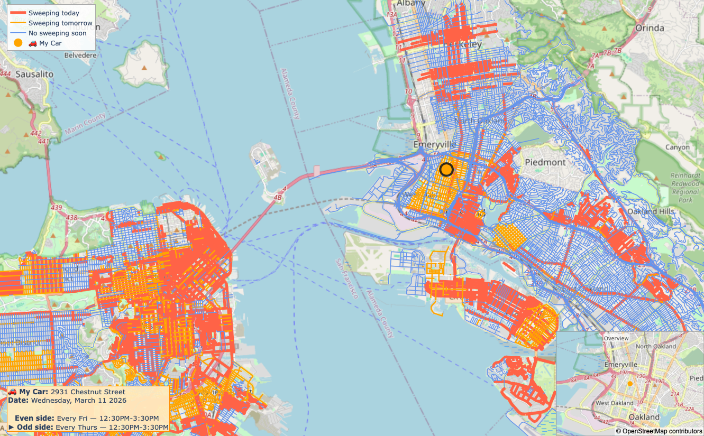
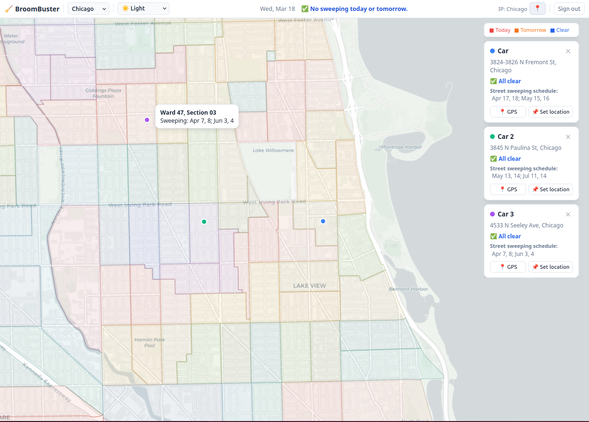

# BroomBuster

An interactive tool that shows where your car is parked on a live map and tells you whether street sweeping applies to that block — today, tomorrow, or not at all.  Supports multiple cities across the Bay Area and Chicago.

**Bay Area**



**Chicago, IL**



## Features

- **Two location modes** — pull live GPS from a [Traccar](https://www.traccar.org/) client (phone app or OBD dongle) _or_ set coordinates manually.
- **Interactive map** — an OpenStreetMap-backed Plotly figure colour-codes every street segment by sweeping urgency:
  - 🔴 **Red** — sweeping today
  - 🟠 **Orange** — sweeping tomorrow
  - 🔵 **Blue** — no sweeping soon
- **Car marker** — coloured dot matches the urgency of the block where your car is parked; hover to see the address.
- **Summary panel** (bottom-left) — shows the address, date, and next sweeping times for both address sides, with an arrow marking your side.
- **Overview inset** (lower-right) — zoomed-out mini-map so you always know where the main view is.
- **Multi-city / regional loading** — load an entire region (e.g. all Bay Area cities) in one run, or switch to single-city mode for faster iteration.
- **Email notification** — opt-in alert when sweeping is same-day or next-day.
- **Credentials via environment variables** — no passwords in source code.

## Supported cities

| City | Data source | Status |
|---|---|---|
| Oakland, CA | Bundled shapefile | ✅ Ready |
| San Francisco, CA | Auto-download from DataSF on first run | ✅ Ready |
| Chicago, IL | 849 ward-section zones auto-download from Chicago Data Portal | ✅ Ready |
| Berkeley, CA | PDF schedules parsed by build script | ✅ Ready |
| Alameda, CA | PDF schedule parsed by build script | ✅ Ready |

## Project layout

```
BroomBuster/
├── data/
│   └── oakland/
│       └── StreetSweeping.shp      # Bundled Oakland shapefile
├── images/
│   ├── bay_area.png                # Screenshots used in this README
│   └── chicago.png
├── src/
│   ├── main.py          # Entry point — configure and run here
│   ├── cities.py        # City and region configuration (URLs, paths, schemas)
│   ├── data_loader.py   # Downloads, caches, and normalises city data
│   ├── car.py           # Car object: location, geocoding, GeoDataFrame helpers
│   ├── gps.py           # Traccar API + Nominatim reverse-geocoding + Overpass streets
│   ├── maps.py          # Interactive Plotly map (car marker + colour-coded streets)
│   ├── analysis.py      # Sweeping schedule parsing and day-matching logic
│   ├── notification.py  # Email alert via Gmail SMTP
│   └── config.py        # Credentials loaded from environment variables / .env
├── .env.example         # Template — copy to .env and fill in your values
└── README.md
```

## Setup

### 1. Install dependencies

```bash
pip install geopandas shapely pyproj plotly geopy requests python-dotenv
```

### 2. Configure credentials

Copy `.env.example` to `.env` and fill in your values:

```bash
cp .env.example .env
```

```dotenv
# Traccar server (only needed when USE_LIVE_GPS = True)
TRACCAR_URL=https://demo4.traccar.org
TRACCAR_USERNAME=you@example.com
TRACCAR_PASSWORD=your_traccar_password

# Gmail notification (only needed when SEND_NOTIFICATION = True)
# Use a Gmail App Password, not your account password
EMAIL_SENDER=you@gmail.com
EMAIL_RECEIVER=you@gmail.com
EMAIL_PASSWORD=your_gmail_app_password
```

Alternatively, export the variables in your shell before running.

### 3. Run

```bash
cd src
python main.py
```

The script opens a browser tab with the interactive map and prints the schedule to the console.

## Configuration flags (top of `main.py`)

| Flag | Default | Description |
|---|---|---|
| `REGION` | `"bay_area"` | Region to load when `SINGLE_CITY_MODE = False` — see `cities.py` for available regions |
| `SINGLE_CITY_MODE` | `True` | `True` → load only `CITY` (faster); `False` → load the full region |
| `CITY` | `"oakland"` | City key used when `SINGLE_CITY_MODE = True` |
| `USE_LIVE_GPS` | `False` | `True` → fetch from Traccar; `False` → use `MANUAL_LAT/LON` |
| `MANUAL_LAT` / `MANUAL_LON` | `None` | Fixed fallback used when `USE_LIVE_GPS = False` (defaults to city/region centre) |
| `PLOT` | `True` | Open the interactive map after each check |
| `SEND_NOTIFICATION` | `False` | Email alert when sweeping is today or tomorrow |
| `CHECK_INTERVAL_H` | `1` | Hours between checks (remove the `break` in main loop to run continuously) |

## Adding a city

### Bay Area

**Berkeley** — schedule published as a PDF at [berkeleyca.gov](https://berkeleyca.gov/city-services/streets-sidewalks-sewers-and-utilities/street-sweeping).  Save the PDFs to `data/berkeley/`, then run `scripts/build_berkeley_geojson.py` to generate `data/berkeley/StreetSweeping.geojson`.

**Alameda** — schedule published as a PDF at [alamedaca.gov](https://www.alamedaca.gov/Residents/Transportation-and-Streets/Street-Sweeping-Schedule).  Save the PDF as `data/alameda/street-sweeping-schedule.pdf`, then run `scripts/build_alameda_geojson.py` to generate `data/alameda/StreetSweeping.geojson`.

### Chicago

Data auto-downloads from the [Chicago Data Portal](https://data.cityofchicago.org) (Socrata dataset `utb4-q645`).  Chicago publishes a new dataset each year (typically March/April) — update the ID in `cities.py → chicago_all` and delete the cached file to force a re-download.

## Traccar GPS setup

1. Install the **Traccar Client** app on your phone ([Android](https://play.google.com/store/apps/details?id=org.traccar.client) / [iOS](https://apps.apple.com/app/traccar-client/id843156974)).
2. Point it at your Traccar server URL and create a device.
3. Set `USE_LIVE_GPS = True` and ensure `TRACCAR_URL`, `TRACCAR_USERNAME`, and `TRACCAR_PASSWORD` are in `.env`.

## Data schema

All city datasets are normalised to a common column schema before analysis and display:

| Column | Description |
|---|---|
| `STREET_NAME` | Street name, upper-case |
| `DAY_EVEN` / `DAY_ODD` | Sweeping day code for even/odd address side (Oakland-style: `ME`, `M13`, `DATES:…`) |
| `DESC_EVEN` / `DESC_ODD` | Human-readable schedule description |
| `TIME_EVEN` / `TIME_ODD` | Sweeping time window (e.g. `8AM–10AM`) |
| `L_F_ADD` … `R_T_ADD` | Address-range bounds for each side of the block |

## Security

- All credentials (Traccar, email) are read from environment variables — never committed to version control.
- Add `.env` to your `.gitignore` to prevent accidental exposure.
